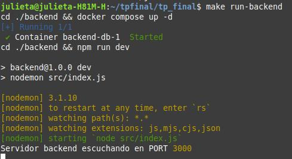
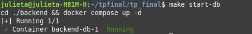
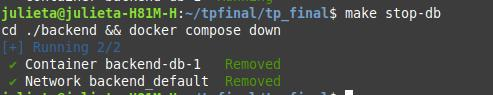
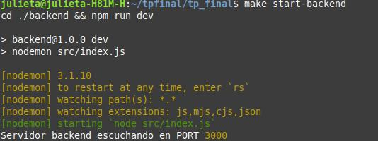
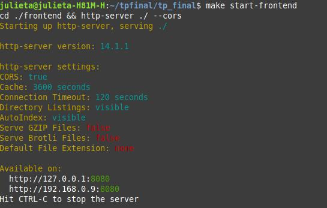
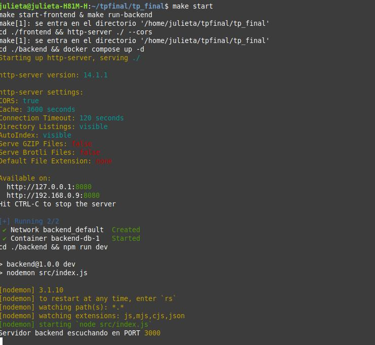

# 🐾 PetHub - Plataforma de adopción de mascotas
- PetHub es una plataforma web pensada para facilitar la adopción responsable de mascotas. Permite a los usuarios ver animales disponibles, realizar solicitudes de adopción y a los administradores gestionar mascotas y solicitudes. 🐈🦜🐇 
- Desarrollo de un sitio web con frontend, backend y base de datos.

---
## 🧠 Descripción general

Este sistema cuenta con:

- Un **frontend** para los usuarios.
- Un **backend** con una API REST construida en Node.js + Express.
- Una **base de datos PostgreSQL** para almacenar la información.
- Contenedores de Docker para facilitar la ejecución.
- Un archivo **Makefile** que simplifica la ejecución de tareas comunes.

---
## 👥 Entidades y campos 
- **mascota**: id,nombre, especie, edad_estimada, tamaño, esta_vacunado, descripcion, id_cuidador
- **usuario**: id, nombre, email, numero, dirección, tiene_patio, tiene_mas_mascotas
- **cuidador**: id, nombre,tipo (voluntario/empleado/cuidador_externo), animales_a_cargo, disponibilidad_horaria
- **formularios_adopcion**(tabla intermediaria): id, fecha, estado (puede ser tipo en proceso/rechazada/aprobada),comentario,id_cuidador_a_cargo, id_usuario, id_mascota 
- **empleados**: id, nombre, password
---
## 🌐 Tecnologías utilizadas 
- **Frontend**: Html, Css personalizado + Bulma y Javascript
- **Backend**: Node.js + Express ( Nodemon para desarrollo) + CORS (permite o restringe que otros sitios web puedan hacer solicitudes a tu API.)
- **Base de datos**: PostregSql
- **Docker + Docker compose**
- **Makefile**

---

##  🛠️ Cómo configurar y levantar el sistema

## 📂 Base de datos 
- Se puede encontrar la estructura de la base de datos en el archivo:
```
./backend/scripts/db.sql
```
- Para correr sql en el docker compose:
```
entramos a la carpeta backend:
docker compose up -d
docker exec -it backend-db-1 psql -U postgres -d pethub 
```
---
## 🔝 Como levantar el sistema 

- Para levantar el backend del proyecto correr:
```
make run-backend
```
📌 Presioná CTRL + C para detener la ejecución cuando lo necesites

📸 Captura del backend en funcionamiento:



- Si solo se quiere levantar la base de datos:
```
make start-db
```
📸 Captura de base de datos en funcionamiento:


- Si se quiere parar la base de datos utilizo:
```
make stop-db
```
📸 Captura de base de datos deteniendo su funcionamiento:


- Si se quiere solo levantar el servidor del backend
```
make start-backend
```
📌 Presioná CTRL + C para detener la ejecución cuando lo necesites

📸 Captura de servidor de backend en funcionamiento:



- Si se quiere solo levantar el servidor del frontend
```
make start-frontend
```
📌 Presioná CTRL + C para detener la ejecución cuando lo necesites

📸 Captura de servidor de frontend en funcionamiento:



- Para correr fronted,backend y base de datos a la vez
```
make start
```
📌 Presioná CTRL + C para detener la ejecución cuando lo necesites

📸 Captura de frontend,backend y base de datos en funcionamiento:


---
✍ Autores

El equipo de PetHub ❤️

Julieta Corvatta, Brhyan Delgado, Nathaly Figueroa y Agustina Mendoza